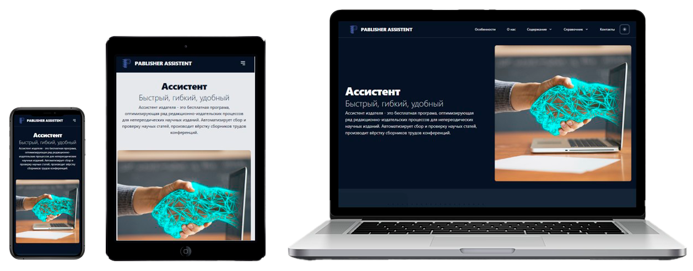
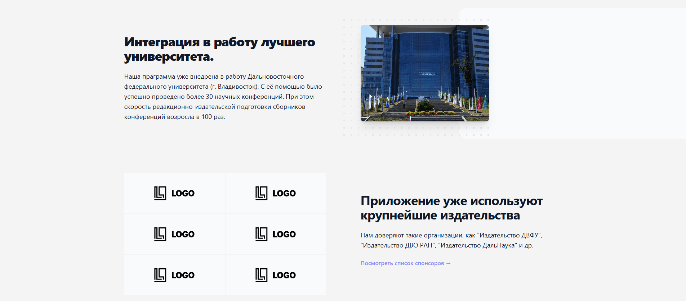
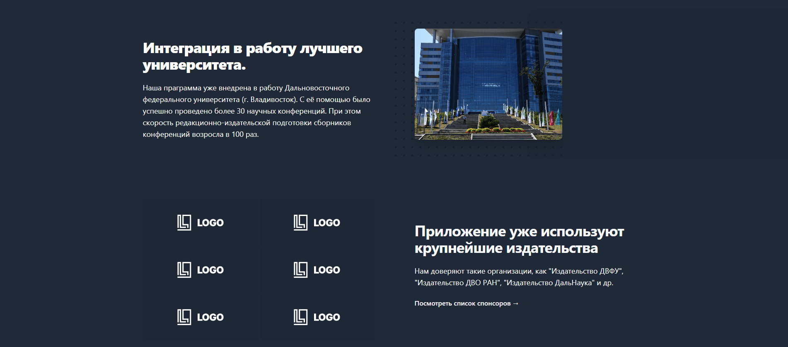
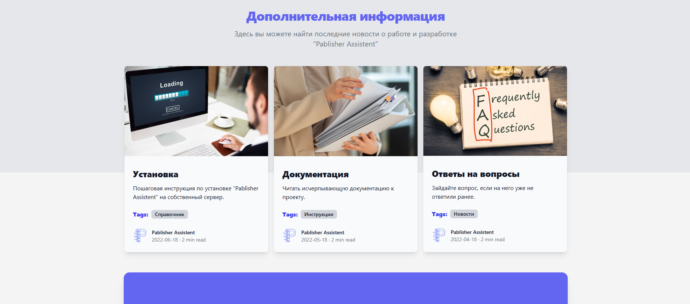
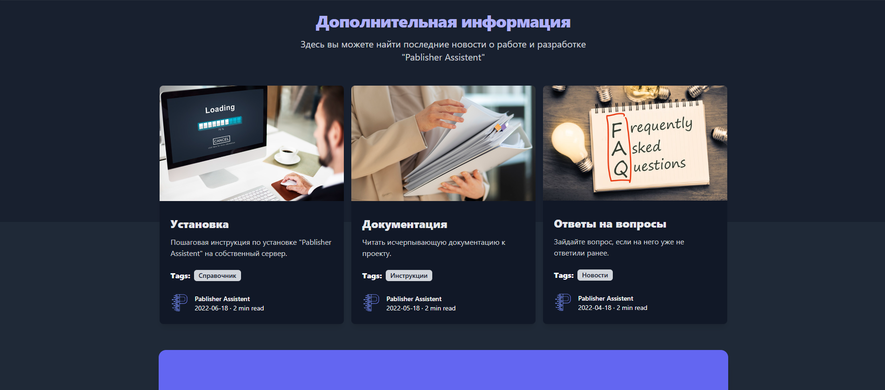

# 🌗 Multi-Theme Landing Page

[](https://github.com/Bit-Maximum/Multi-Theme-Lending/blob/main/README.md)
[](https://github.com/Bit-Maximum/Multi-Theme-Lending/blob/main/translation/README.ru.md)

> *A training single-page landing site with support for light and dark themes.*



## 🧪 About the Project

This project was created as **practice in layout development**. The main goal was to improve skills in building a modern single-page website with **theme switching support (light/dark)**. The project does not serve any specific practical purpose beyond that.

## 💡 Features
- 💡 Light and dark theme toggle
- 💻 Responsive layout for both mobile and desktop devices
- 🧱 Clean and minimalist design
- 📄 Static layout without build tools or frameworks

## 🚀 How to Run

The project can be launched via Docker or locally:

### 🐳 Run with Docker

If you have [Docker](https://www.docker.com/) installed, you can run the project in a container:
   ```bash
   docker run -d -p 8080:80 bitmaximum/multi-theme-lending:latest
   ```
The site will be available at: `http://localhost:8080`

### (Alternative) Run Locally:

1. Clone the repository:
   ```bash
   git clone https://github.com/Bit-Maximum/Multi-Theme-Lending
   ```

2. Open `index.html` in your browser.
>❗ No installation or build step is required. All files are static.

## 📸 Gallery

https://github.com/user-attachments/assets/9bf6a008-1373-40d7-b688-7f9b76dca072

</img> </img> </img> </img>

## 📱 Responsiveness

The site is optimized for both desktop and mobile screens. Flexible grid layouts and media queries were used to ensure a comfortable reading experience across various devices.


## ⚙️ Stack

- HTML5
- CSS
- JavaScript (pure)
