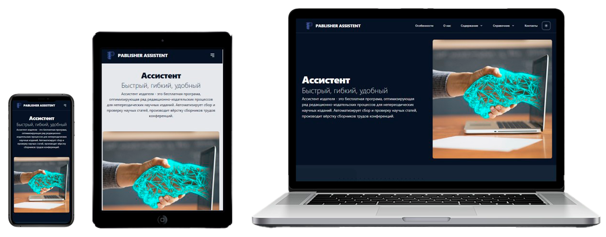

# 🌗 Лендинг с разными темами

[](https://github.com/Bit-Maximum/Quest-Book-WEB/blob/master/README.md)
[](https://github.com/Bit-Maximum/Quest-Book-WEB/blob/master/translation/README.ru.md)

> *Учебный одностраничный лендинг с поддержкой светлой и тёмной темы оформления.*



## 🧪 О проекте

Этот проект был выполнен мной в качестве **тренировки по вёрстке**. Основная цель — отработать навыки создания современного одностраничного сайта с **поддержкой смены темы оформления (светлая / тёмная)**.

## 🚀 Запуск проекта

Проект можно открыть с помощью Docker или локально:

### 🐳 Запуск в Docker

Если у вас установлен [Docker](https://www.docker.com/), вы можете запустить проект в контейнере:
   ```bash
   docker run -d -p 8080:80 bitmaximum/quest-book-web:latest
   ```
Сайт будет доступен по адресу: `http://localhost:8080`

### (Альтернативно) Запуск локально:

1. Склонировать репозиторий:
   ```bash
   git clone https://github.com/Bit-Maximum/Quest-Book-WEB
   ```

2. Открыть `index.html` в браузере.
>❗ Не требует установки или сборки. Все файлы — статические.


## 📸 Галерея


## 📱 Адаптивность

Сайт оптимизирован как для настольных, так и для мобильных устройств. Использованы гибкие сетки и медиа-запросы для комфортного чтения на разных экранах.

## 💡 Особенности
- 💡 Светлая и тёмная тема
- 💻 Адаптивная вёрстка для мобильных и десктопных устройств
- 🧱 Чистый и минималистичный дизайн
- 📄 Статическая верстка без сборщиков и фреймворков

## ⚙️ Используемые технологии

- HTML5
- CSS
- JavaScript (чистый)